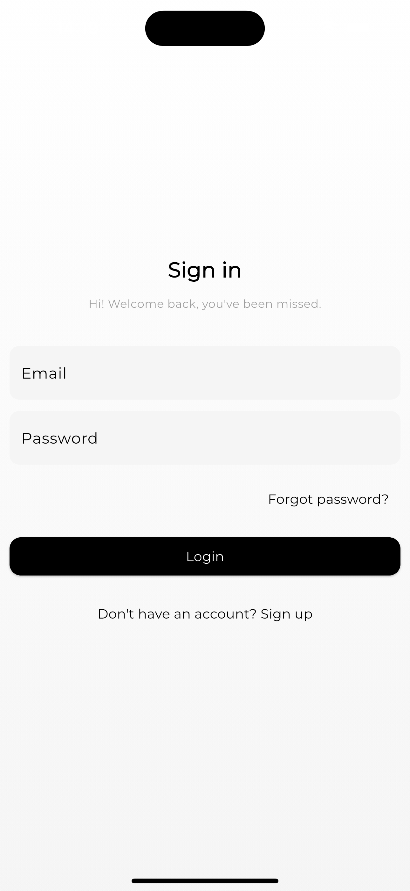
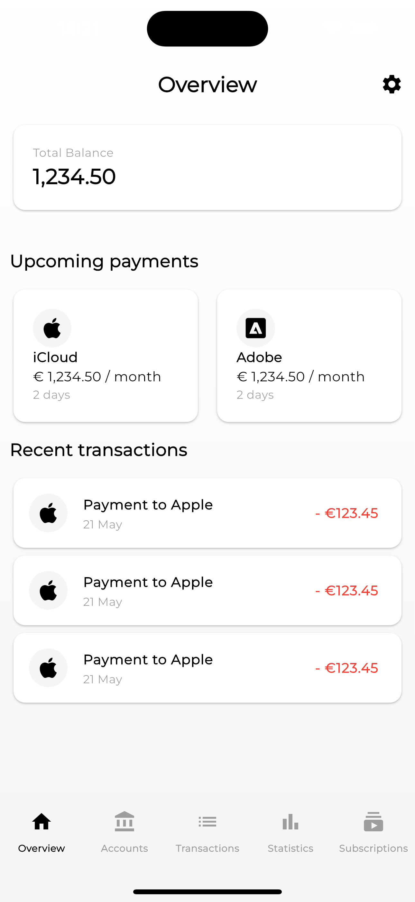

# Qubook

An open-source finance manager powered by [Flutter][flutter] and [Laravel][laravel], designed for clean insight and personal clarity.

---

> Please note that Qubook is still under active development

## Installation

### Backend

```bash
cd backend
composer run dev
```

### Frontend

```bash
cd frontend
flutter pub get
flutter run
```

---

## Folder Structure

```
lib/
├── main.dart
├── pages/
│   └── settings/
│       ├── theme.dart
│   ├── accounts.dart
│   ├── home.dart
│   ├── login.dart
│   ├── overview.dart
│   ├── settings.dart
│   ├── splash.dart
│   ├── statistics.dart
│   ├── subscriptions.dart
│   ├── transactions.dart
├── styles/
│   ├── text.dart
│   └── theme.dart
├── utilities/
│   └── notifiers.dart
├── widgets/
│   ├── bar.dart
│   ├── gradient.dart
│   └── navigation.dart
```

---

### License

Qubook is licensed under the _Functional Source License, Version 1.1, MIT Future License_. It's free to use for
internal and non-commercial purposes, but it's not allowed to use a release for commercial purposes (competing use). See our [full license][license] for more details.

### Contributing

This project is under active development. Contributions are welcome.

---

## Screenshots





[flutter]: https://flutter.dev/
[laravel]: https://laravel.com
[license]: LICENSE.md
